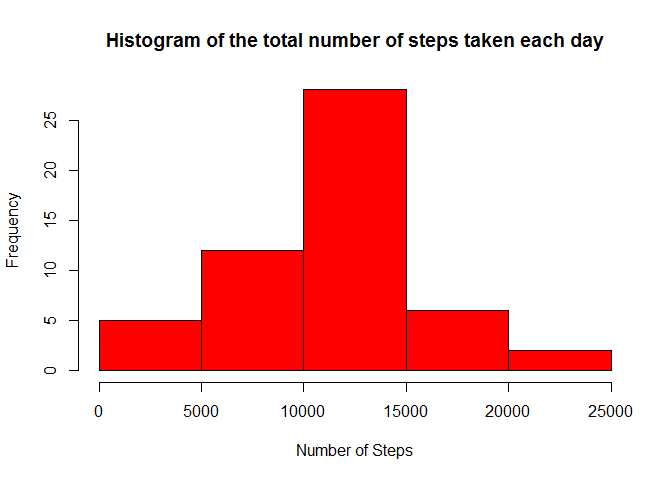
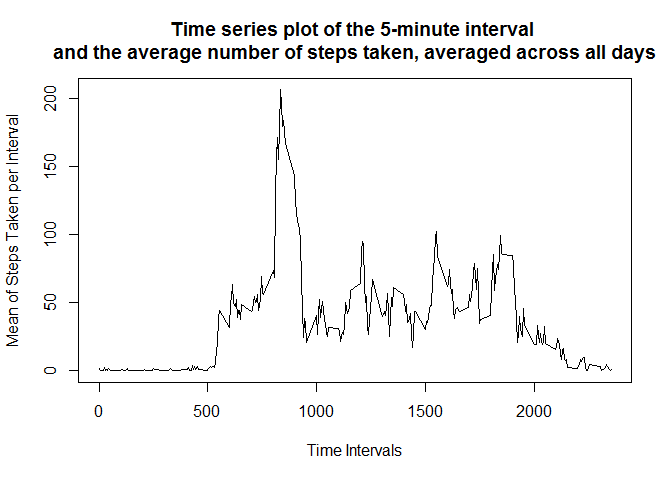
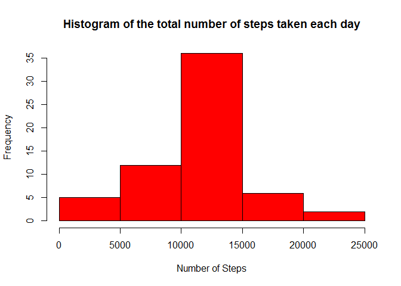
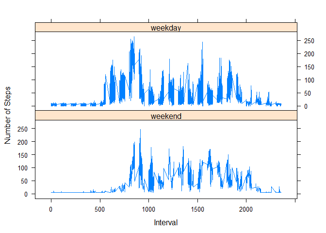

# Reproducible Research: Peer Assessment 1

## Loading and preprocessing the data

Time series plot of the average number of steps taken
The 5-minute interval that, on average, contains the maximum number of steps
Code to describe and show a strategy for imputing missing data
Histogram of the total number of steps taken each day after missing values are imputed
Panel plot comparing the average number of steps taken per 5-minute interval across weekdays and weekends

Load the data (<b>DO NOT FORGET TO EDIT THE PATH BEFORE RERUN THE CODE!</b>)

```r
setwd("C:\\Users\\AzzA\\Desktop\\RepData_PeerAssessment1-master")
rawData <- read.csv(file.path(getwd(),"activity.csv"),sep=",")
```
## What is mean total number of steps taken per day?

Ignore missing values

```r
noNAdata <- na.omit(rawData)
```

1. Calculate the total number of steps taken per day

```r
stepsEachDay <- aggregate(noNAdata$steps ~ noNAdata$date, noNAdata, sum)
names(stepsEachDay) <- c("date","steps")
stepsEachDay$steps <- as.numeric(stepsEachDay$steps)
```

2. If you do not understand the difference between a histogram and a barplot, research the difference between them. Make a histogram of the total number of steps taken each day

```r
hist(stepsEachDay$steps, main="Histogram of the total number of steps taken each day", xlab="Number of Steps", col="red")
```



3.Calculate and report the mean and median of the total number of steps taken per day

```r
stepsEachDayMedian = median(stepsEachDay$steps)
stepsEachDayMean =  mean(stepsEachDay$steps)
```
<b>1.0766189\times 10^{4}</b> is the mean of total number of steps taken per day 
<b>1.0765\times 10^{4}</b> is the median of total number of steps taken per day

## What is the average daily activity pattern?

1.Make a time series plot (i.e. type = "l") of the 5-minute interval (x-axis) and the average number of steps taken, averaged across all days (y-axis)

```r
stepsEachInterval <- aggregate(noNAdata$steps ~ noNAdata$interval, noNAdata, sum)
names(stepsEachInterval) <- c("interval","steps")

averages <- stepsEachInterval$steps / length(stepsEachDay$steps)

plot(as.numeric(as.character(averages)) ~ as.numeric(as.character(stepsEachInterval$interval)) , 
     type="l", xlab="Time Intervals", ylab="Mean of Steps Taken per Interval",
     main ="Time series plot of the 5-minute interval \nand the average number of steps taken, averaged across all days")
```



2.Which 5-minute interval, on average across all the days in the dataset, contains the maximum number of steps?

```r
theInterval <- stepsEachInterval$interval[which(averages==max(averages))]
```
<b>835</b>. 5-minute interval, on average across all the days in the dataset, contains the maximum number of steps
## Imputing missing values
1.Calculate and report the total number of missing values in the dataset (i.e. the total number of rows with NAs)

```r
naPos <- which(is.na(rawData$steps))
missing <- length(naPos)
```
<b>2304</b> is the total number of missing values in the dataset.

2.Devise a strategy for filling in all of the missing values in the dataset. The strategy does not need to be sophisticated. For example, you could use the mean/median for that day, or the mean for that 5-minute interval, etc.

```r
meanPerDay <- stepsEachDay$steps/length(unique(rawData$interval))
stepsEachDay<-cbind(stepsEachDay,meanPerDay)
```
Chosing the mean for that day...

3.Create a new dataset that is equal to the original dataset but with the missing data filled in.

```r
means <- rep(mean(rawData$steps, na.rm=TRUE), times=length(naPos))
newDataset <- rawData
newDataset[naPos, "steps"] <- means
```

4.Make a histogram of the total number of steps taken each day and Calculate and report the mean and median total number of steps taken per day.

```r
stepsEachDay <- aggregate(newDataset$steps ~ newDataset$date, newDataset, sum)
names(stepsEachDay) <- c("date","steps")
stepsEachDay$steps <- as.numeric(stepsEachDay$steps)
hist(stepsEachDay$steps, main="Histogram of the total number of steps taken each day", xlab="Number of Steps", col="red")
```



```r
stepsEachDayMedian = median(stepsEachDay$steps)
stepsEachDayMean =  mean(stepsEachDay$steps)
```
<b>1.0766189\times 10^{4}</b> is the mean of total number of steps taken per day 
<b>1.0766189\times 10^{4}</b> is the median of total number of steps taken per day
 Do these values differ from the estimates from the first part of the assignment? What is the impact of imputing missing data on the estimates of the total daily number of steps?
<b>These values don't differ greatly from the estimates from the first part of the assignment.</b> 

## Are there differences in activity patterns between weekdays and weekends?

1.Create a new factor variable in the dataset with two levels weekday and weekend indicating whether a given date is a weekday or weekend day.

```r
if(!require(timeDate)){
    install.packages("timeDate")
    library(timeDate)
}
```

```
## Loading required package: timeDate
```

```r
newDataset$day <- weekdays(as.Date(newDataset$date))
newDataset$isWeekday <- isWeekday(newDataset$date, wday=1:5)
newDataset$dayType <- factor(newDataset$isWeekday, levels=c(FALSE, TRUE), labels=c('weekend', 'weekday'))
head(newDataset)
```

```
##     steps       date interval    day isWeekday dayType
## 1 37.3826 2012-10-01        0 Monday      TRUE weekday
## 2 37.3826 2012-10-01        5 Monday      TRUE weekday
## 3 37.3826 2012-10-01       10 Monday      TRUE weekday
## 4 37.3826 2012-10-01       15 Monday      TRUE weekday
## 5 37.3826 2012-10-01       20 Monday      TRUE weekday
## 6 37.3826 2012-10-01       25 Monday      TRUE weekday
```

2.Make a panel plot containing a time series plot (i.e. type = "l") of the 5-minute interval (x-axis) and the average number of steps taken, averaged across all weekday days or weekend days (y-axis). See the README file in the GitHub repository to see an example of what this plot should look like using simulated data.

```r
means <- aggregate(newDataset$steps,by=list(newDataset$dayType,newDataset$day, newDataset$interval), mean)
names(means) <- c("dayType", "day", "interval", "mean")
library("lattice")
xyplot(mean ~ interval | dayType, means, type="l", lwd=1, xlab="Interval", ylab="Number of Steps", layout=c(1,2))
```



<center>--- End of Fun ---</center>
