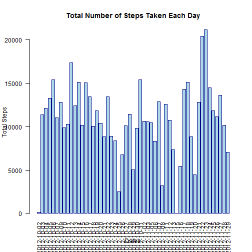

# Reproducible Research: Peer Assessment 1

## Loading and preprocessing the data

Let's load date and process/transform the data (if necessary) into a format suitable for our analysis


```r
fileName <- "activity.csv"
rawData <- read.csv(file.path(getwd(),fileName),header=TRUE)
```
## What is mean total number of steps taken per day?

Let's get rid of NA steps...

```r
noNA_rawData <- rawData[!is.na(rawData$steps),] # Gets rid of NA steps, but it isn't enough so...

noNA_rawData$date<- factor(noNA_rawData$date) # Drops the levels that do not occur
```
and make a histogram of the total number of steps taken each day.

```r
stepsSumGroupByDate_noNA_rawData <- tapply(noNA_rawData$steps,noNA_rawData$date,FUN=sum) # Calculates the total number of steps taken each day

barplot(stepsSumGroupByDate_noNA_rawData, col = "lightblue",border = "dark blue", main = "Total Number of Steps Taken Each Day",las=1,las=2,xlab="Dates",ylab="Total Steps") # Makes a histogram of the total number of steps taken each day
```

 

Let's calculate the mean and median total number of steps taken per day

```r
meanOfStepsTakenPerDay <- mean(stepsSumGroupByDate_noNA_rawData)
medianOfStepsTakenPerDay <- median(stepsSumGroupByDate_noNA_rawData)
```
<b>Mean</b> of total number of steps taken per day is <b>1.0766 &times; 10<sup>4</sup></b>.  
<b>Median</b> of total number of steps taken per day is <b>10765</b>.

## What is the average daily activity pattern?

Let's find sum of steps when we group by intervals...

```r
stepsSumGroupByInterval_noNA_rawData <- tapply(noNA_rawData$steps,noNA_rawData$interval,FUN=sum) # Finds sum of steps when we group by intervals
```

Let's find count of Intervals and their means accordingly

```r
countsOfIntervals <- table(noNA_rawData$interval)

mean_stepsSumGroupByInterval_noNA_rawData <- stepsSumGroupByInterval_noNA_rawData / countsOfIntervals
```

Let's make a time series plot of the 5-minute interval (x-axis) and the average number of steps taken, averaged across all days (y-axis)

```r
mean_stepsSumGroupByInterval_noNA_rawData <- data.frame(mean_stepsSumGroupByInterval_noNA_rawData)

library(lattice) # Do not forget

xyplot(Freq  ~ Var1,mean_stepsSumGroupByInterval_noNA_rawData,type="l",main="5-minute interval (x-axis) \nand\n the average number of steps taken, averaged across all days (y-axis)",xlab="5-min intervals",ylab="avg. num. of steps taken",lwd=3)
```

 

Which 5-minute interval, on average across all the days in the dataset, contains the maximum number of steps?

```r
maxPair <- mean_stepsSumGroupByInterval_noNA_rawData[which(mean_stepsSumGroupByInterval_noNA_rawData$Freq == max(mean_stepsSumGroupByInterval_noNA_rawData$Freq)),]
maxInterval <- maxPair$Var1
```

The <b>835</b> 5-minute interval, on average across all the days in the dataset, contains the maximum number of steps.

## Imputing missing values
Calculate and report the total number of missing values in the dataset (i.e. the total number of rows with NAs)

```r
numOfMissingValues <- dim(rawData)[1] - dim(noNA_rawData)[1]
```

The total number of missing values in the dataset is <b>2304</b>  

Devise a strategy for filling in all of the missing values in the dataset. The strategy does not need to be sophisticated. For example, you could use the mean/median for that day, or the mean for that 5-minute interval, etc.

We are going to use the mean for that 5-minute interval

Lets create a new dataset that is equal to the original dataset but with the missing data filled in.


```r
filled_rawData <- merge(mean_stepsSumGroupByInterval_noNA_rawData,rawData,by.x="Var1",by.y="interval")

naIndices <- which(is.na(filled_rawData$steps))

filled_rawData[naIndices,"steps"] <- filled_rawData[naIndices,"Freq"]

filled_rawData <- filled_rawData[,-2] # No need "Freq" col anymore

names(filled_rawData) <- c("interval","steps","date") # Rename names
```

Lets make a histogram of the total number of steps taken each day 

```r
stepsSumGroupByDate_filled_rawData <- tapply(filled_rawData$steps,filled_rawData$date,FUN=sum) # Calculates the total number of steps taken each day

barplot(stepsSumGroupByDate_filled_rawData, col = "lightblue",border = "dark blue", main = "Total Number of Steps Taken Each Day",las=1,las=2,xlab="Dates",ylab="Total Steps") # Makes a histogram of the total number of steps taken each day
```

 

Lets calculate and report the mean and median total number of steps taken per day. 

```r
meanOfStepsTakenPerDay_filled_rawData <- mean(stepsSumGroupByDate_filled_rawData)
medianOfStepsTakenPerDay_filled_rawData <- median(stepsSumGroupByDate_filled_rawData)
```

The <b>mean</b> of total number of steps taken per day is <b>1.0766 &times; 10<sup>4</sup></b>.  
The <b>median</b> of total number of steps taken per day is <b>1.0766 &times; 10<sup>4</sup></b>.  

There is no difference for mean but median differed. New median is equal to mean. According to my calculation, imputing missing data on the estimates of the total daily number of steps yields an evenly distributed set.

## Are there differences in activity patterns between weekdays and weekends?
Using the dataset with the filled-in missing values...

Lets create a new factor variable in the dataset with two levels – “weekday” and “weekend” indicating whether a given date is a weekday or weekend day.

```r
weekdays <- weekdays(as.Date(filled_rawData$date))
weekendIndices <- which(weekdays == "Saturday" | weekdays == "Sunday")
weekType <- rep("weekday", dim(filled_rawData)[1])
weekType[weekendIndices] <- "weekend"
filled_rawData <- cbind(filled_rawData, weekType)
```

Lets make a panel plot containing a time series plot (i.e. type = "l") of the 5-minute interval (x-axis) and the average number of steps taken, averaged across all weekday days or weekend days (y-axis).

Lets start with weekend

```r
weekend_steps <- filled_rawData$steps[which(filled_rawData$weekType=="weekend")] # filter out weekdays
weekend_interval <- filled_rawData$interval[which(filled_rawData$weekType=="weekend")] # filter out weekdays
weekend_stepsSumGroupByInterval_filled_rawData <- tapply(weekend_steps,weekend_interval,FUN=sum) # Finds sum of steps when we group by intervals
interval_counts <- table(weekend_interval)
m_weekend_stepsSumGroupByInterval_filled_rawData <- data.frame(weekend_stepsSumGroupByInterval_filled_rawData/interval_counts)
```

And continue with weekday

```r
weekday_steps <- filled_rawData$steps[which(filled_rawData$weekType=="weekday")] # filter out weekdend
weekday_interval <- filled_rawData$interval[which(filled_rawData$weekType=="weekday")] # filter out weekdend
weekday_stepsSumGroupByInterval_filled_rawData <- tapply(weekday_steps,weekday_interval,FUN=sum) # Finds sum of steps when we group by intervals
interval_counts <- table(weekday_interval)
m_weekday_stepsSumGroupByInterval_filled_rawData <- data.frame(weekday_stepsSumGroupByInterval_filled_rawData/interval_counts)
```

Lets plot this, ( xyplot(Ozone ~ Wind | Month, data = airquality, layout = c(5, 1)) in lectures is my starting point )

```r
m_weekday_stepsSumGroupByInterval_filled_rawData <- cbind(m_weekday_stepsSumGroupByInterval_filled_rawData, rep("weekday",dim(m_weekday_stepsSumGroupByInterval_filled_rawData)[1]))

names(m_weekday_stepsSumGroupByInterval_filled_rawData) <- c("interval","mean", "weekType")

m_weekend_stepsSumGroupByInterval_filled_rawData <- cbind(m_weekend_stepsSumGroupByInterval_filled_rawData, rep("weekend",dim(m_weekend_stepsSumGroupByInterval_filled_rawData)[1]))

names(m_weekend_stepsSumGroupByInterval_filled_rawData) <- c("interval","mean", "weekType")

plotData <- rbind(m_weekday_stepsSumGroupByInterval_filled_rawData,m_weekend_stepsSumGroupByInterval_filled_rawData)

xyplot(mean  ~ interval | weekType,plotData,type="l",main="5-minute interval (x-axis) \nand\n the average number of steps taken,\n averaged across all (WEEKDAY-WEEKEND) days (y-axis)",xlab="5-min intervals",ylab="avg. num. of steps taken",lwd=3,layout = c(1, 2))
```

 

EndOfFun
